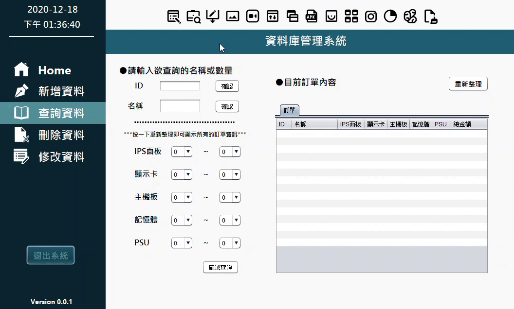
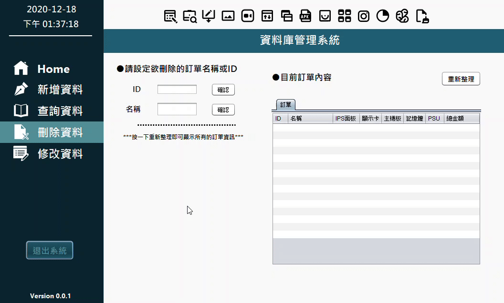

# OrderWindows-Demo
+ A database management system by using NetBeans with MySQL.
+ There are two parts of windows in this project: Login and Management interface.

**Code Author: Vaan Lin**

**Last update: 2020/12/17**

## Requirements
#### Java
+ JDK            1.8.0
+ JRE            1.8.0
#### MySQL
+ MySQL Workbench 8.0 CE

**Notice: If you want to modify my java code in NetBeans, you need to**

**1. Install NetBeans IDE 8.2 RC**

**2. Add library of mysql-connector-java-5.1.49.jar which is at ./execute/lib.**

## Preparement
**You can run the complete java code directly by double clicking OderWindowDemo.jar in "execute" folder, but before doing this we need to do something first.**
1. Open your MySQL Workbench and setup a new connection with username=root and password=1234.
2. After logining MySQL Workbench, click Data Import/Restore.
3. Import from "execute" folder and choose schema of "company".
4. Click button of import at Import Progress.
5. Right click and click refresh all in schema interface, then you will see the schema of company showing up!

## How to use and Demo
**If you have done all steps of Requirments and Preparement, you can run directly by double clicking OderWindowDemo.jar in "execute" folder.**
### Login Interface
You can
+ Input root of username and 1234 of password to login this database management system.

+ Click cancel button will exit the whole execution.

### Management Interface
There are five functions in the slide bar on the left, including
+ Home - Home Page
+ 新增資料 - you can add new data in this function
+ 查詢資料 - you can query data conditionally in this function
+ 刪除資料 - you can delete data in this function
+ 修改資料 - you can modify data you choose in this function

After logining you will see the home page of Management System.
#### HomePage

+ You can change the color of the whole theme at home page.

#### 新增資料
1. You can add new data by inputting the order name at column of "訂單名稱".
2. Choose the number of each commodity including 
+ IPS 面板
+ 顯示卡
+ 主機板
+ 記憶體
+ PSU
3. Check this order is or not the member in the system by clicking the "會員打95折" button, if is, it will auto 5% off at totally price.
4. Click "確認新增" to add new data into MySQL database, and you can click "重新整理" to see the data table after updating on the right.

#### 查詢資料
1. You can query the data of MySQL database you want by inputting
+ ID - 
+ 名稱 - 
+ IPS 面板 -
+ 顯示卡 -
+ 主機板 -
+ 記憶體 -
+ PSU -

**Notice: It is no need to enter value at every coloum, just input the value or name you want to query.**

#### 刪除資料

#### 修改資料

